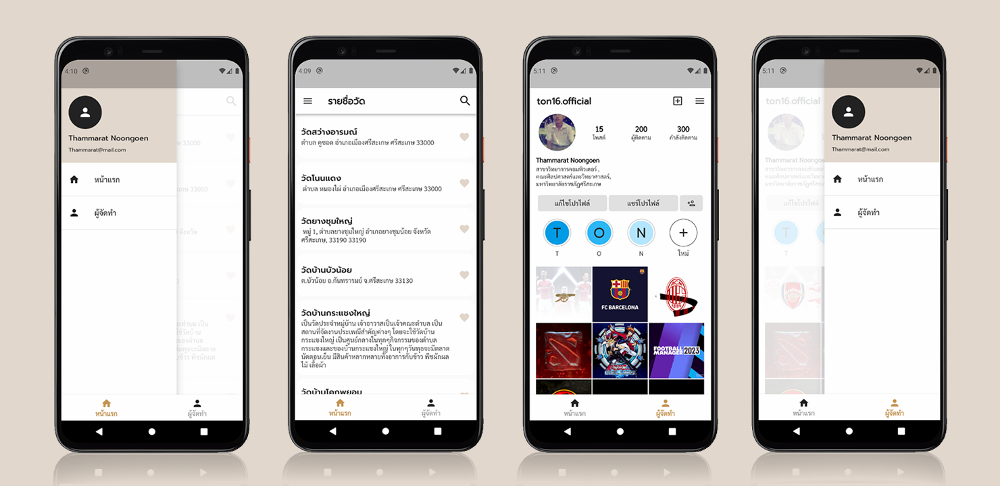

# Project Flutter 
<h5 align="center">พัฒนาโดย</h5>
<h3 align="center">นายธรรมรัตน์ หนูเงิน</h3>

<h4 align="center">สาขาวิทยาการคอมพิวเตอร์, คณะศิลปศาสตร์และวิทยาศาสตร์ มหาวิทยาลัยราชภัฏศรีสะเกษ</h4>

### แพ็กเกจที่ใช้

- csv : [link](https://pub.dev/packages/csv)
- google_fonts : [link](https://pub.dev/packages/google_fonts)


## เพิ่ม Dependencies ใน Flutter

```yaml
dependencies:
  flutter:
    sdk: flutter
  ..
  cupertino_icons: ^1.0.0
  csv: ^5.0.1
  google_fonts: ^3.0.1
```

### การใช้งาน

```dart
import 'package:csv/csv.dart';
import 'package:google_fonts/google_fonts.dart';
```
## การอ่านข้อมูลจากไฟล์ .csv  
- นำเข้าข้อมูล .csv จากโฟลเดอร์ assets 
- แปลงข้อมูลใน .csv เป็น string ส่วนข้อมูลที่เป็น int และ bouble จะไม่เปลี่ยน 
  โดยใช้ CsvListConverter
- แสดงผลข้อมูลเป็น List 

```yaml
flutter:

 
  uses-material-design: true

  assets:
      - assets/ข้อมูลวัด.csv
```

```dart

List<List<dynamic>>? data;

  @override
  void initState() {
    super.initState();
    loadAsset();
  }

  Future<void> loadAsset() async {
    final String response = await rootBundle.loadString('assets/ข้อมูลวัด.csv');
    final List<List<dynamic>> decoded = CsvToListConverter().convert(response);
    setState(() {
      data = decoded;
    });
  }
```

### การแสดงผลข้อมูล
- ListView จะเป็น

- title ถูกกำหนดให้แสดงข้อมูลในแถวที่ 1
- subtitle ถูกกำหนดให้แสดงข้อมูลในแถวที่ 6 
```dart
body: Center(
        child: Container(
          child: data == null
              ? const Center(child: CircularProgressIndicator())
              : ListView.builder(
                  itemCount: data!.length - 1,
                  itemBuilder: (BuildContext context, int index) {
                    final List<dynamic> row = data![index + 1];
                    return Expanded(
                      child: Card(
                        child: SizedBox(
                          child: Column(
                            children: ListTile.divideTiles(
                              context: context,
                              tiles: [
                                ListTile(
                                  shape: RoundedRectangleBorder(
                                    borderRadius: BorderRadius.circular(15),
                                  ),
                                  title: Text(
                                    row[1],
                                    style: GoogleFonts.prompt(
                                        fontSize: 18,
                                        fontWeight: FontWeight.w600),
                                  ),
                                  subtitle: Text(row[6]),
                                  contentPadding: const EdgeInsets.all(10.0),
                                  trailing: Wrap(
                                    spacing: 12,
                                    children: const <Widget>[
                                      Icon(
                                        Icons.favorite,
                                        color: Color(0xFFe1d5c9),
                                      ),
                                    ],
                                  ),
                                ),
                              ],
                            ).toList(),
                          ),
                        ),
                      ),
                    );
                  },
                ),
        ),
      ),

```
## Bottom Navigator Bar
- _selectedIndex ถูกกำหนดไว้ที่ 0 เป็นการกำหนดให้แสดงหน้า Index 0
- _onItemTapped จะทำงานเมื่อมีการกดไปยังปุ่ม
  - เมื่อกดที่ปุ่ม หน้าแรก จะนำทางไปยัง HomePage [Index0]
  - เมื่อกดที่ปุ่ม ผู้จัดทำ จะนำทางไปยัง ProfileMe [Index1]

```dart
class _BottomNavBarState extends State<BottomNavBar> {
  int _selectedIndex = 0;
  final List<Widget> _widgetOptions = <Widget>[
    Center(
      child: HomePage(),
    ),
    Center(
      child: ProfileMe(),
    ),
  ];

  void _onItemTapped(int index) {
    setState(() {
      _selectedIndex = index;
    });
  }

  @override
  Widget build(BuildContext context) {
    return Scaffold(
      body: Center(
        child: _widgetOptions.elementAt(_selectedIndex),
      ),
      bottomNavigationBar: BottomNavigationBar(
        items: const <BottomNavigationBarItem>[
          BottomNavigationBarItem(
            icon: Icon(Icons.home),
            label: 'หน้าแรก',
          ),
          BottomNavigationBarItem(
            icon: Icon(Icons.person),
            label: 'ผู้จัดทำ',
          ),
        ],
        currentIndex: _selectedIndex,
        onTap: _onItemTapped,
        unselectedFontSize: 14.0,
        selectedFontSize: 14.0,
      ),
    );
  }
}
```
## Drawer Menu
- ใช้สำหรับนำทางมักจะแสดงตรงมุมขาวบน หรือ มุมซ้ายบน

```dart
class _DrawerMenuState extends State<DrawerMenu> {
  @override
  Widget build(BuildContext context) {
    return Drawer(
      child: ListView(
        padding: EdgeInsets.zero,
        children: <Widget>[
          const UserAccountsDrawerHeader(
            decoration: BoxDecoration(
               color: Color(0xFF3e1d5c9),
            ),
            accountName: Text(
              'Thammarat Noongoen',
              style: TextStyle(color: Color(0xFF202222), fontSize: 16),
            ),
            accountEmail: Text(
              'Thammarat@mail.com',
              style: TextStyle(color: Color(0xFF202222), fontSize: 12),
            ),
            currentAccountPicture: CircleAvatar(
              radius: 10.0,
              backgroundColor: Color(0xFF202224),
              child: Icon(
                Icons.person,
                size: 30,
                color: Color(0xFFfefefe),
              ),
            ),
          ),
          ListTile(
            leading: const Icon(
              Icons.home,
              color: Color(0xFF202224),
            ),
            tileColor: Color(0xFFfefefe),
            title: const Text(
              'หน้าแรก',
              style: TextStyle(fontSize: 16),
            ),
            onTap: () {},
          ),
          const Divider(
            color: Color(0xFFBDBDBD),
          ),
          ListTile(
            leading: Icon(Icons.person, color: Color(0xFF202224)),
            tileColor: Color(0xFFfefefe),
            title: const Text(
              'ผู้จัดทำ',
              style: TextStyle(fontSize: 16),
            ),
            onTap: () {},
          ),
          const Divider(
            color: Color(0xFFBDBDBD),
          ),
        ],
      ),
    );
  }
}
```
### เรียกใช้ Drawer Menu
- drawer จะเป็นการแสดงผลที่มุมซ้ายบน
- endDrawer จะเป็นการแสดงผลที่มุมขาวบน
```dart
 @override
  Widget build(BuildContext context) {
    return Scaffold(
    drawer: DrawerMenu(),
    .
    .
    .
    .
    );

```

## ตัวอย่างหน้าจอ User Interface 



